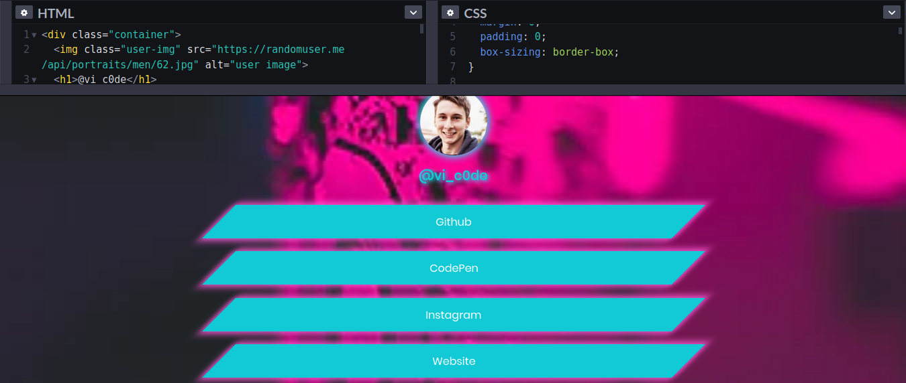

# Neon Themed

## LinkTree Clone

### To Use

- Clone the repo
- Add your profile image and background image to the images folder
  - profile image should be named "profile-image.jpg"
  - background image should be named "background-image.jpg"
- GoTo index.html and change the text inside "h1" tag to your name
- Add/Replace your links by editing or adding "a" tags

> Done, Now your Neon Themed Linktree clone is ready
> You can host the project to Github pages, Netlify or your provider of your choice

> Checkout Project on CodePen: https://codepen.io/vishnu_dileesh/pen/zYrEgXz

